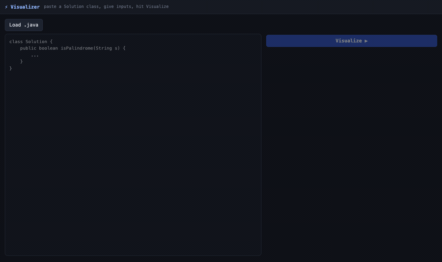

# Code Visualizer

Step through the **real execution** of a Java method in the browser: line
highlighting, live variable state, and pointer markers over arrays and strings.

Paste a `class Solution`, give it inputs, press Visualize.



Existing visualizers animate a *model* of your code. This one attaches a real
debugger to a real JVM and reports what actually happened, so what you see is
your program's behavior rather than an approximation of it.

Zero external dependencies. It compiles with `javac` and runs on a JDK.

```bash
./visualize          # compile and serve at http://localhost:4747
./test.sh            # compile and run the full test suite
```

Requires a JDK 20 or newer (it uses the JDK's own compiler and debugger APIs).

---

## How it works

The core problem is getting truthful execution data out of arbitrary code
without running that code inside this process.

The approach: generate a driver, compile it with debug symbols, launch it as a
**separate JVM** under the Java Debug Interface, and single step it from the
outside while reading stack frames over the debugger connection. The traced
program never shares memory with the visualizer, and it is killed on the way out
whatever happens.

```
  source ──► Analyzer ──► Driver ──► Compiler ──► Tracer ──► Condenser ──► Trace JSON
              (parse      (generate   (javac      (JDI step   (group raw     (single
              signature)   a main)     in memory)  a child     steps into     contract
                                                   JVM)        semantics)     the UI reads)
                                        │
                          Inputs ───────┘
                     (parse literals into
                      real Java objects)
```

Every stage is a small class with one job:

| File | Lines | Responsibility |
|---|---:|---|
| `driver/Analyzer.java` | 70 | Finds the public methods on the pasted class and extracts each signature. This is what populates the method picker and the typed input fields. |
| `driver/Inputs.java` | 168 | Parses input literals (`5`, `true`, `'c'`, `"text"`, `[1,2,3]`, `[[1,2],[3]]`, `{"a":1}`, `null`) into real Java values, with overflow and malformed input reported as field errors rather than crashes. |
| `driver/Driver.java` | 25 | Generates a `__Driver` class with a `main` that constructs the arguments and calls the target method. Handles instance vs static and returning vs void. |
| `compile/Compiler.java` | 63 | Compiles the solution and the driver **in memory** via `javax.tools.JavaCompiler`, with `-g` so locals survive. Maps compiler diagnostics back to the line the user actually typed. |
| `trace/Tracer.java` | 179 | The heart of it. Launches `__Driver` in a child JVM through JDI, sets method entry, method exit, exception and line step requests filtered to `Solution`, and reads the top stack frame's visible locals at every step. |
| `trace/Vals.java` | 154 | Serializes live JDI values into the wire format. Reads `List`, `Map`, `Set` and boxed types out of the debuggee without asking it to run `toString`, with a bounded fallback for everything else. |
| `annotate/Annotator.java` | 41 | Detects which local is indexing which collection (`arr[i]`, `s.charAt(l)`) so the UI can draw pointer markers under the right cell. |
| `condense/Condenser.java` | 77 | Collapses raw line steps into semantic groups, so a hundred step loop reads as "iteration 4" instead of a hundred anonymous frames. |
| `model/Trace.java` | 27 | The JSON contract between backend and frontend, as records. The frontend consumes this and nothing else. |
| `util/Json.java` | 149 | A JSON reader and writer, including record support. Written rather than pulled in, to keep the dependency count at zero. |
| `server/Server.java` | 94 | `com.sun.net.httpserver` endpoints for `/api/analyze` and `/api/trace`, plus static files. Rejects path traversal out of `web/`. |
| `Pipeline.java` | 88 | Wires the stages together and is the single place errors are turned into a stage-tagged response. |
| `Main.java` | 32 | `serve` for the web app, `trace` for headless JSON on stdout. |

The frontend is plain browser JavaScript, no framework and no build:

| File | Lines | Responsibility |
|---|---:|---|
| `web/setup.js` | 132 | Paste or load a file, debounced analyze, typed input fields, error display. |
| `web/player.js` | 96 | Transport controls, scrubber, playback speed, semantic and line modes. |
| `web/renderers.js` | 103 | Draws the state cards: arrays with index labels, maps, scalars, pointer markers. |

### Why a separate JVM

Running the pasted code in this process would mean an infinite loop hangs the
tool, a `System.exit` kills it, and a stack overflow takes down the server. As a
child process under a debugger, all three are just events to handle. It also
means the traced program cannot see or touch the visualizer's own state.

### The bit that took the longest

Reading a `HashMap` out of a live debuggee is not simply calling `toString`.
Invoking a method on the debuggee requires resuming it, which perturbs the very
execution being measured. `Vals.java` walks the collection's internal fields
over the debugger connection instead, and falls back to a bounded `toString`
only for types it does not recognize.

---

## Guardrails

Arbitrary pasted code is hostile input, so the limits are explicit:

- **10 second wall clock timeout** on the traced program.
- **2,000 raw step cap**, after which the trace is returned as-is and marked.
- **The child JVM is destroyed during cleanup on every path**, including
  timeout, step cap, exception, and normal completion.
- Static file serving resolves the real path and refuses anything outside
  `web/`.
- Unrecognized types degrade to a `toString` value card rather than failing the
  whole trace.

A result carries its own `kind`, one of `return`, `exception`, `timeout` or
`stepcap`, so the UI can say which of those happened instead of showing an
empty state.

---

## Tests

```bash
./test.sh
```

No test framework: the tests are plain `main` methods with an assertion
helper, in keeping with the zero dependency rule.

`bench/` holds fixtures that exist to prove the failure paths, not the happy
one: a program that hangs, one that reads out of bounds, one that spins, and a
palindrome implementation that returns the wrong answer.

`TestTracerEnds` asserts the timeout and step cap actually fire.

---

## Headless use

The tracer is usable without the UI, which is how most of the tests drive it:

```bash
java -cp out viz.Main trace bench/two-sum/Solution.java '[2,7,11,15]' '9'
```

Prints the trace JSON on stdout.

---

## Input literal syntax

| Type | Example |
|---|---|
| int, long, double | `5`, `-3`, `2.5` |
| boolean | `true` |
| char | `'c'` |
| String | `"text"` |
| array or list | `[1,2,3]` |
| nested | `[[1,2],[3]]` |
| map | `{"a":1}` |
| null | `null` |

---

## Known limits

Stated up front, because they are the first things you would hit:

- The traced class must expose a public method the analyzer can read, normally
  on `class Solution`, and every parameter type must be one `Inputs` supports.
  Nested maps are rejected.
- Stepping is **line level**, so several operations on one line cannot be
  separated. A whole `while` body written on one line cannot be stepped into
  its parts; put the body on its own lines.
- `STEP_OVER` is used, so calls the solution makes are not stepped into.
- Two sequential top level loops are currently grouped as one in semantic mode.
  Line mode is unaffected.
- Snapshot failures, for example a frame compiled without debug information,
  are skipped rather than surfaced. Making every degradation visible in the UI
  is not finished.

## License

MIT. See [LICENSE](LICENSE).
